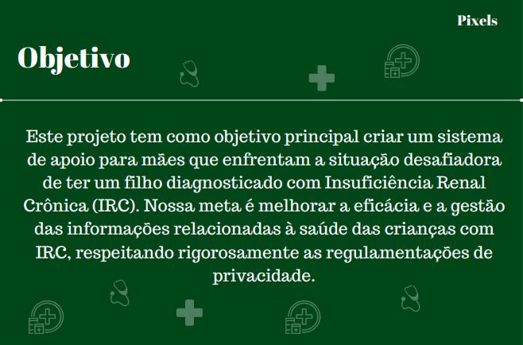
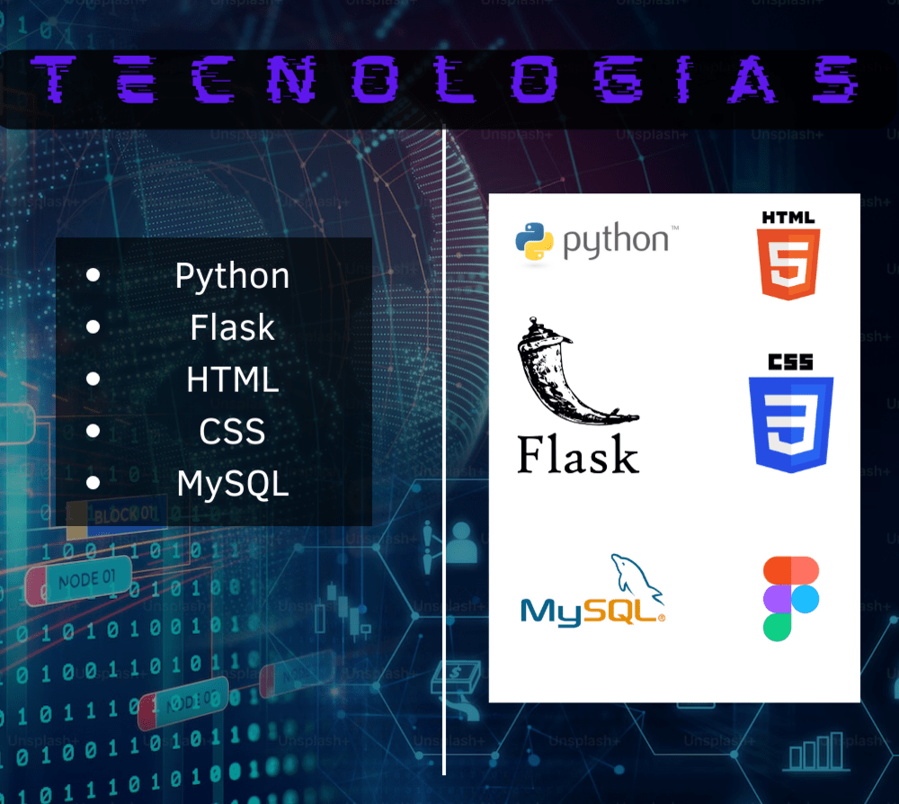

# Projeto Grupo de Mães

  <a href="#projeto">Projeto</a>  •
  <a href="#📌-proposta">Proposta</a>  •
  <a href ="#📆-cronograma-das-entregas"> Cronograma das Entregas </a>  • 
  <a href ="#🛠️-tecnologias"> Tecnologias Utilizadas </a>  • 
  <a href ="#backlog-do-produto">Backlog do Produto </a>  •
  <a href ="#👥-equipe"> Equipe </a> 

## 📌 Proposta
**Desenvolver um website para auxiliar mães que possuem filhos com a doença Insuficiência Renal Crônica**  

> **Requisitos Funcionais**
-  Tela de Login
-  Tela de Cadastro
-  Tela de Recuperação de Senha 
-  Home com Cards de Redirecionamento
-  Blog
-  Area do ADM
-  Area do User
-  Página com Localidades dos hospitais
-  Página com Sintomas Comuns e formulário
-  Filtro para o Blog
-  Área de Comentários
-  Graficos de Dados Levantados IRC

 

> **Requisitos Não Funcionais**
-  Framework Python Flask
-  Linguagem Python, Html e CSS
-  Banco de Dados Relacional - MySQL
-  Levantamento de Dados (Raspagem)
-  Arquitetura no Figma

 

## 📆 Cronograma das Entregas
-  Sprint 1 (Kick Off) - 04/09/23 a 25/09/23 

 

## Projeto

 

## 🛠️ Tecnologias

 

## Backlog do Produto

 

## 👥 Equipe

| Nome                   | Função         | Linkedin                                                                                      | GitHub                                        |
| ---------------------- | -------------- | --------------------------------------------------------------------------------------------- | --------------------------------------------- |
| **Kauê Francisco**     | Scrum Master   | [@LinkedIn](https://www.linkedin.com/in/kau%C3%AA-francisco-3b13aa255/?originalSubdomain=br)  | [@GitHub](https://github.com/Kaue-Francisco)  | 
| **Diogo Palharini**    | Product Owner  | [@LinkedIn](https://www.linkedin.com/in/diogo-palharini-10b803275/)                           | [@GitHub](https://github.com/DiogoPalharini)  | 
| **Daiene Batagioti**   | Desenvolvedora | [@LinkedIn](https://www.linkedin.com/in/daiene-batagioti/)                                    | [@GitHub](https://github.com/Daiene)          | 
| **Arthur Karnas**      | Desenvolvedor  | [@LinkedIn](https://www.linkedin.com/in/arthur-karnas-da-rocha-b90433271/)                    | [@GitHub](https://github.com/Karnas01)        | 
| **José Eduardo**       | Desenvolvedor  | [@LinkedIn](https://www.linkedin.com/in/jos%C3%A9-eduardo-fernandes-pereira-b26517284/)       | [@GitHub](https://github.com/ZduardoPereira)  | 
| **Eduardo Fonseca**    | Desenvolvedor  | [@LinkedIn](https://br.linkedin.com/in/eduardo-namiuti-5641b627b)                             | [@GitHub](https://github.com/eduardofsn)      | 
| **Erik Yokota**        | Desenvolvedor  | [@LinkedIn](https://www.linkedin.com/in/vin%C3%ADcius-barbosa-78111a206/)                     | [@GitHub](https://github.com/yokotaerik)      | 
| **Kathellyn Caroline** | Desenvolvedora | [@LinkedIn]()                                                                                 | [@GitHub]()                                   |
| **Juan Soares**        | Desenvolvedor  | [@LinkedIn](https://www.linkedin.com/in/ojuansoares/)                                         | [@GitHub](https://github.com/ojuansoares)     | 

 

<a href="#projeto-grupo-de-mães">Voltar ao Topo</a>