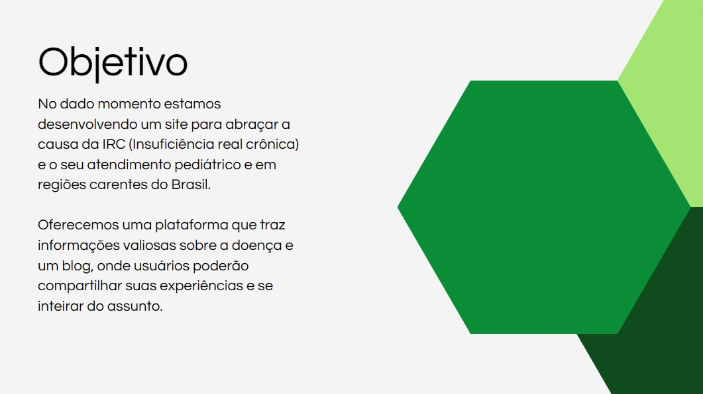
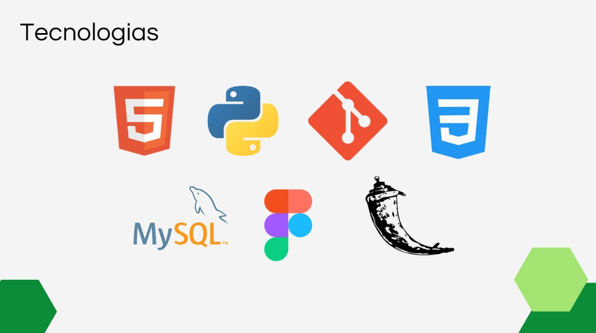
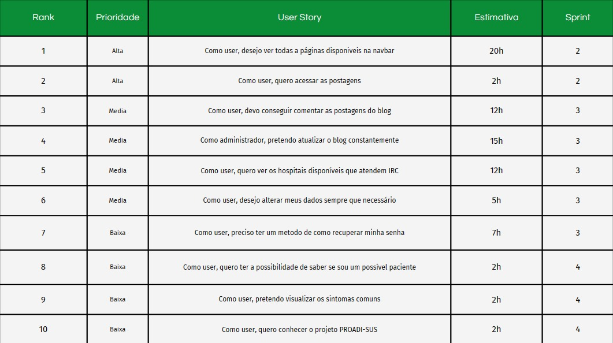
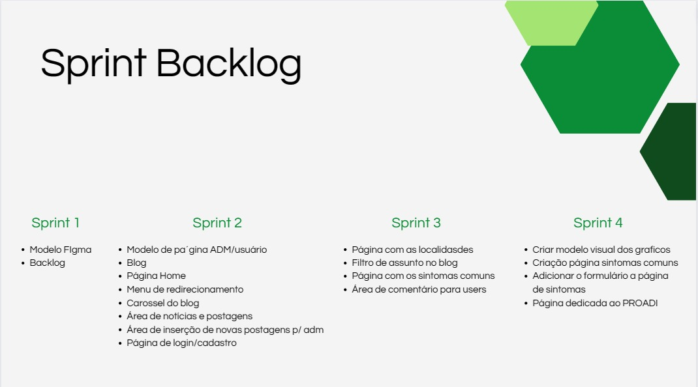

# Projeto Grupo de Mães


## Projeto

<br>

<p align="center">
  <a href="#projeto">Projeto</a>  •
  <a href="#proposta">Proposta</a>  •
  <a href="#cronograma-das-entregas">Cronograma das Entregas</a> • 
  <a href="#tecnologias">Tecnologias Utilizadas </a>  • 
  <a href="#backlog-do-produto">Backlog do Produto </a>  •
  <a href="#equipe"> Equipe </a> 
</p>

## Proposta
**Desenvolver um website para auxiliar mães que possuem filhos com a doença Insuficiência Renal Crônica**<br><br>

> **Requisitos Funcionais**
-  Tela de Login
-  Tela de Cadastro
-  Tela de Recuperação de Senha 
-  Blog
-  Area do ADM
-  Area do User
-  Página com Localidades dos hospitais
-  Página com Sintomas Comuns
-  Filtro para o Blog
-  Área de Comentários
-  Graficos de Dados Levantados IRC

<br>

> **Requisitos Não Funcionais**
-  Framework Python Flask
-  Linguagem Python, Html e CSS
-  Banco de Dados Relacional - MySQL
-  Levantamento de Dados (Raspagem)
-  Arquitetura no Figma

<br>


## Cronograma das Entregas
-  Sprint 1 - 04/09/23 a 24/09/23 
-  Sprint 2 - 25/09/23 a 15/10/23 
-  Sprint 3 - 16/10/23 a 05/11/23 
-  Sprint 4 - 06/11/23 a 26/11/23 

<br>

## MVP
[](https://youtu.be/ABOGftJAD0A?si=lbFesrLnPFxRXtep)

<br>

## Tecnologias

<br>

## Backlog do Produto


### Backlog por Sprint

<br>

## Como Executar
```bash

# Navegando pelo github acesse o repositório ou acesse este link: https://github.com/Daiene/Pixels

# Depois clique no botão VERDE <> Code

# Selecione a opção HTTPS e copie o link.

# Agora vá para o terminal e digite o seguinte comando e cole o link:
$ git clone https://github.com/Daiene/Pixels.git

# Agora acesse a pasta clonada
$ cd Pixels

# Para executar os seguinte comandos a seguir você deve ter python instalado em seu computador!

# Você irá precisar criar um ambiente virtual em python
$ python -m venv env

# Agora você deve acessar essa ambiente virtual com o seguinte comando:

# Windows:
$ .\env\Scripts\activate

# Linux:
$ source env/bin/activate

# Agora que você esta dentro do ambiente virtual você deve baixar as depêndencias com o seguinte comando:
$ pip install -r src/requeriments.txt

# Agora com as dependências baixadas você precisa verificar se a conexão com o banco de dados esta correta.

# Para isso verifique a conexão com no arquivo service.py se seu usuário e senha estão de acordo com a sua conexão no banco de dados

# Agora acesse a pasta src
$ cd src/

# E execute o seguinte comando:
$ flask run

# Depois irá liberar um ip local para você 127.0.0.1:5000
# Se você digitar este IP no seu navegador ira abrir o projeto!

```

## Equipe

| Avatar                                            | Nome                   | Função         | Linkedin                                                                                      | GitHub                                          |
| ------------------------------------------------- | ---------------------- | -------------- | --------------------------------------------------------------------------------------------- | ----------------------------------------------- |
|           | **Kauê Francisco**     | Scrum Master   | [@LinkedIn](https://www.linkedin.com/in/kau%C3%AA-francisco-3b13aa255/?originalSubdomain=br)  | [@GitHub](https://github.com/Kaue-Francisco)    | 
|         | **Diogo Palharini**    | Product Owner  | [@LinkedIn](https://www.linkedin.com/in/diogo-palharini-10b803275/)                           | [@GitHub](https://github.com/DiogoPalharini)    | 
|        | **Arthur Karnas**      | Desenvolvedor  | [@LinkedIn](https://www.linkedin.com/in/arthur-karnas-da-rocha-b90433271/)                    | [@GitHub](https://github.com/Karnas01)          | 
|           | **José Eduardo**       | Desenvolvedor  | [@LinkedIn](https://www.linkedin.com/in/jos%C3%A9-eduardo-fernandes-pereira-b26517284/)       | [@GitHub](https://github.com/ZduardoPereira)    | 
|     | **Eduardo Fonseca**    | Desenvolvedor  | [@LinkedIn](https://br.linkedin.com/in/eduardo-namiuti-5641b627b)                             | [@GitHub](https://github.com/eduardofsn)        | 
|           | **Erik Yokota**        | Desenvolvedor  | [@LinkedIn](https://www.linkedin.com/in/vin%C3%ADcius-barbosa-78111a206/)                     | [@GitHub](https://github.com/yokotaerik)        | 
|           | **Juan Soares**        | Desenvolvedor  | [@LinkedIn](https://www.linkedin.com/in/ojuansoares/)                                         | [@GitHub](https://github.com/ojuansoares)       | 

<br>

<a href="#projeto-grupo-de-mães">Voltar ao Topo</a>